[github](https://github.com/Adwaith585) &nbsp;·&nbsp;
[instagram](https://instagram.com/adwaith.sa._) &nbsp;·&nbsp;
[email](mailto:adwaithsa24@gmail.com) &nbsp;·&nbsp;
[itch.io](https://itch.io)

> B-tech CS student passionate about building real things. 
> Crafting code to solve complex problems.

I am actively exploring full-stack web development and applied cybersecurity. 
Right now I am deeply focused on game development, building interactive 2D and 3D 
mechanics using Unity, C#, and OpenGL. I am also fascinated by artificial 
intelligence, regularly experimenting with machine learning and computer vision.

<samp>python &nbsp; c &nbsp; c++ &nbsp; java &nbsp; c# &nbsp; html5 &nbsp; javascript &nbsp; mysql &nbsp; mongodb &nbsp; sqlite</samp> 
<samp>pytorch &nbsp; tensorflow &nbsp; pandas &nbsp; numpy &nbsp; figma &nbsp; photoshop &nbsp; unity &nbsp; opengl &nbsp; arduino</samp>

**[LIFE-OF-CUBE](https://github.com/Adwaith585/LIFE-OF-CUBE)** &nbsp;·&nbsp; <samp>asp.net</samp> 
The first game I uploaded on this platform. 
Early explorations into game mechanics and interactive environments.

**[dashcart-mvp](https://github.com/Adwaith585/dashcart-mvp)** &nbsp;·&nbsp; <samp>typescript</samp> 
Full-stack DashCart eCommerce web development MVP application. 
Features complete authentication flows, product listings, and cart state management.

**[VentureVision-Pro](https://github.com/Adwaith585/VentureVision-Pro)** &nbsp;·&nbsp; <samp>python</samp> 
Autonomous AI agent designed to automate Venture Capital due diligence. 
Uses a recursive ReAct loop to autonomously research and compile memos.

**[Push-UP-Counter](https://github.com/Adwaith585/Push-UP-Counter)** &nbsp;·&nbsp; <samp>python</samp> 
Computer vision program to count the number of push-ups so you don't have to. 
Built to automate tracking using real-time pose estimation.

Every graphic here is generated, not embedded from anyone else's server. 
`ascii.svg` is a photo pushed through a character ramp; the stat graphics and 
these section headings are drawn by [a scheduled action](.github/workflows/refresh.yml) 
straight from the GitHub GraphQL API, once a day, committing only what changed.

They animate with SMIL inside the SVG, because GitHub strips scripts from 
READMEs — and since nothing loads from a third party, nothing here can 
rate-limit or go dark.
